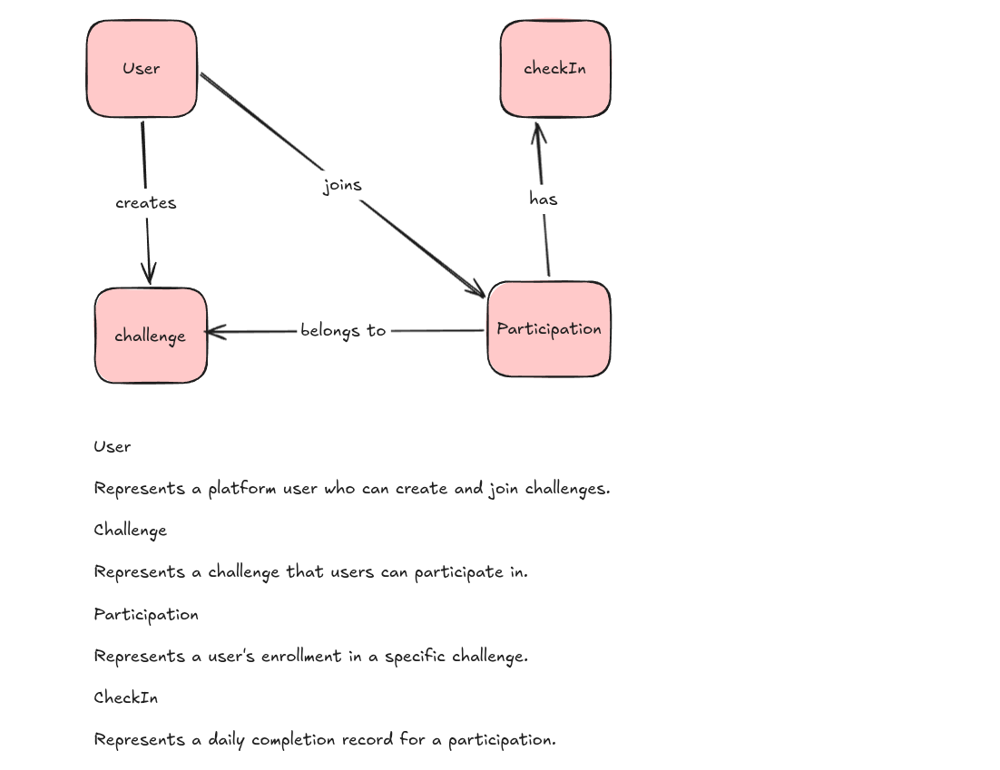

# 🚀 Momentum Backend
[](https://github.com/nadashaban11/momentum-backend/actions/workflows/ci.yml)

> **Build consistency. Maintain momentum.**  
> A NestJS API designed to drive daily consistency through challenge tracking, atomic check-ins, and an automated streak engine.

🔗 **[Explore Live Swagger Documentation & Test API](https://momentum-backend-production-4873.up.railway.app/api)**

---

##  Overview

Many people start personal challenges (like *100 Days of Code*, reading goals, or any challenges) but lose momentum after a few days due to a lack of structure, tracking, and strict accountability. 

**Momentum** solves this by providing a reliable backend system that enforces daily discipline. Unlike standard todo apps, Momentum introduces a **Strict Streak Engine**—if you miss a daily check-in, your streak breaks. No retroactive check-ins, no cheating the system.

---

**Momentum High-level Diagram**



---


## Technical Highlights

This repository is built with a focus on **clean architecture, strict domain rules, and scalability**, moving beyond simple CRUD operations:

* **Strict Business Logic & Data Integrity:** Implements real-world domain rules (e.g., locking challenge entry after the start date, preventing duplicate daily check-ins, and auto-joining creators to their challenges).
* **Automated Streak Engine:** Utilizes scheduled background tasks (**Cron Jobs**) running at midnight to recalculate active streaks and automatically flag missed ones.
* **Smart Leaderboard Sorting:** Dynamic ranking algorithm that orders participants by `Current Streak`, tie-breaking with `Completion Rate`, and finally `Total Check-ins`.

* **Interactive Documentation:** Fully integrated with Swagger UI for client-side integration and instant API testing.

---

## Tech Stack

| Component | Technology |
| :--- | :--- |
| **Framework** | [NestJS](https://nestjs.com/) (TypeScript) |
| **Database** | PostgreSQL |
| **ORM** | TypeORM |
| **Authentication** | JWT (JSON Web Tokens) + Passport |
| **Validation** | Class-Validator & Class-Transformer |
| **Documentation** | Swagger |
| **Containerization** | Docker & Docker Compose |

---

##  Core Business Rules 

To make momentum meaningful, the API enforces strict accountability:
1. **One Check-in Per Day:** A user can only submit one successful check-in per calendar day.
2. **No Late Joiners:** Users cannot join a challenge once its `startDate` has passed.
3. **No Retroactive Check-ins:** Forgot to check in yesterday? The streak breaks. You cannot check in for past dates.
4. **Creator Auto-Enrollment:** When a user creates a challenge, they are automatically enrolled as the first participant.
5. **Locked Challenges:** Users cannot leave a challenge after it begins, and owners cannot delete challenges that have active participants.

---

## Automated Background Jobs

The platform relies on scheduled tasks (`@nestjs/schedule`) to maintain data consistency without manual intervention:

* **Midnight Streak Processing :** Scans all active participations, increments streaks for successful check-ins, and resets broken streaks to zero for missed days.

---

##  Getting Started (Local Development)

### 1. Prerequisites
* Node.js (v18+)
* Docker & Docker Compose
* Git

### 2. Clone & Install
```bash
git clone https://github.com/nadashaban11/momentum-backend.git
cd momentum-backend
npm install
```
### 3. Environment Setup
the example environment file and configure your local database credentials:

```Bash
cp .env.example .env
```
### 4. Run with Docker (Recommended)
Spin up the PostgreSQL database and the NestJS server instantly using Docker Compose:

```Bash
docker compose up --build 
```

Or run locally without Docker:

```Bash
# Start development server with watch mode
npm run start:dev
```

## API Documentation (Swagger)
Once the server is running, explore and test all endpoints interactively via the Swagger UI:

Visit: http://localhost:3000/api


### What's Next 

To ensure the highest quality for the MVP, several features were intentionally will be rolled out in future iterations:

- Private Challenges (Invite codes & shareable links) & Team vs. Team Challenges

- Gamification (Badges, Milestone Achievements, and Avatar customization)

- Advanced Analytics (Weekly progress graphs and email insights)

- Social Accountability (Push notifications & reminder nudges)
